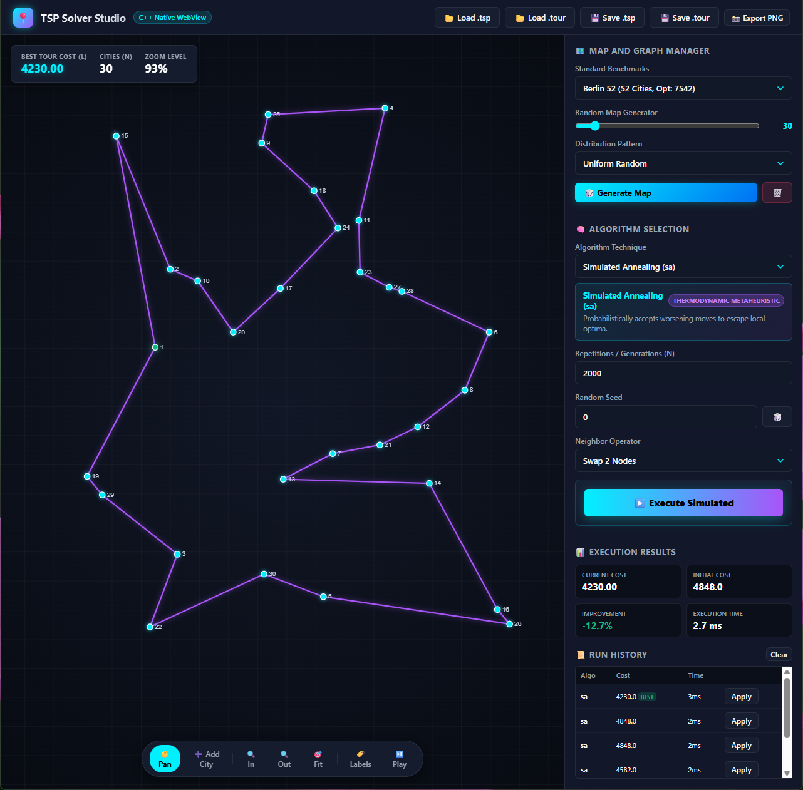

# Traveling Salesman Problem Solver & Studio

[](https://github.com/vikman90/traveling-salesman/actions/workflows/cmake.yml)
[](LICENSE)
[](https://en.cppreference.com/w/cpp/17)

A high-performance C++ solution and interactive desktop visualizer for the **Traveling Salesman Problem (TSP)**. It provides 16 optimization algorithms spanning greedy heuristics, local search descent, evolutionary and genetic algorithms, and parallel metaheuristics.

<!-- Screenshot placeholder: replace with your image path (e.g. docs/images/screenshot.png) -->
<p align="center">
  
</p>

---

## 🌟 Applications Overview

The project provides two independent executables built from a unified C++17 core engine:

### 1. Desktop GUI Visualizer (`tsp-gui`)
An interactive desktop visualizer powered by native C++ and lightweight WebView (WebKitGTK on Linux, WebView2 on Windows, WKWebView on macOS):
- **Interactive 2D Canvas:** Hardware-accelerated rendering with smooth mouse-wheel zoom, pan, and real-time node dragging.
- **Dynamic City Placement:** Switch to *Add City* mode to insert custom nodes with instant path recalculation.
- **Tour Playback Animation:** Step-by-step traversal animation with glowing pulse indicator.
- **Dynamic Parameter Studio:** Forms adapt in real time to the selected algorithm (iterations, random seeds, population sizes, evolutionary schemes, migration topology).
- **Map Generator:** Generate **Uniform Random**, **Metropolitan Clusters**, and **Circular Ring** graph distributions (5 to 300+ cities).
- **TSPLIB Benchmark Presets:** Instant one-click loading of standard benchmarks (`berlin52`, `kroA100`, `a280`).
- **Drag & Drop & Export:** Drag any `.tsp` or `.tour` file onto the window, and export solutions as TSPLIB files or high-resolution PNG images.

### 2. High-Performance CLI (`tsp`)
The original command-line interface for fast headless execution and batch benchmarking.

```bash
tsp [-a ALGORITHM [-n REP] [-s SEED] [-m METHOD]] [-c TOUR] [-o TOUR] TSP
```

---

## 🧠 Supported Optimization Algorithms

| Category | Algorithm | CLI Identifier (`-a`) | Parameter Controls |
| :--- | :--- | :--- | :--- |
| **Constructive Heuristics** | Greedy Search | `greedy` | Deterministic |
| | Greedy + Local Search | `greedyls` | Deterministic |
| | Greedy + Extended Local Search | `greedyls+` | Iterations (`-n`), Seed (`-s`) |
| | GRASP (Greedy Randomized Adaptive) | `grasp` | Iterations (`-n`), Seed (`-s`) |
| | GRASP Extended | `grasp+` | Iterations (`-n`), Seed (`-s`) |
| **Neighborhood & Local Search** | Random Search | `rs` | Iterations (`-n`), Seed (`-s`) |
| | Local Search (2-Opt First Improvement) | `ls` | Seed (`-s`) |
| | Variable Neighborhood Descent | `vnd` | Iterations (`-n`), Seed (`-s`) |
| | Basic Multiboot Search | `bmb` | Iterations (`-n`), Seed (`-s`) |
| | Iterated Local Search | `ils` | Iterations (`-n`), Seed (`-s`) |
| | Variable Neighborhood Search | `vns` | Iterations (`-n`), Seed (`-s`) |
| **Metaheuristics & Evolutionary** | Simulated Annealing | `sa` | Iterations (`-n`), Seed (`-s`), Operator (`swap`/`invert`) |
| | Genetic Algorithm | `ga` | Pop Size (`-d`), Iterations (`-n`), Scheme (`gener`/`stat`), Seed (`-s`) |
| | Memetic Algorithm | `ma` | Pop Size (`-d`), Iterations (`-n`), Hybridization Schedule, Seed (`-s`) |
| **Parallel Metaheuristics** | Parallel Simulated Annealing | `psa` | Processes (`-p`), Latency (`-l`), Iterations (`-n`), Seed (`-s`) |
| | Parallel Genetic Algorithm | `pga` | Processes (`-p`), Latency (`-l`), Topology (`ring`/`star`), Pop Size (`-d`), Seed (`-s`) |

---

## 📦 Prerequisites & Dependencies

- **Compiler:** Modern C++17 compiler (GCC 9+, Clang 10+, MSVC 2019+)
- **CMake:** Version 3.22 or higher
- **Linux (for Desktop GUI):**
  ```bash
  sudo apt-get install -y libwebkit2gtk-4.1-dev libgtk-3-dev
  ```
  *(If building on a minimal headless Linux server without GUI libraries, CMake will automatically build the CLI and test suite).*
- **Windows:** Microsoft Edge WebView2 (included by default in Windows 10/11)
- **macOS:** System Cocoa and WebKit frameworks (included with macOS)

---

## 🛠️ Build & Installation

```bash
# 1. Clone repository
git clone https://github.com/vikman90/traveling-salesman.git
cd traveling-salesman

# 2. Configure with CMake
cmake -B build -S . -DCMAKE_BUILD_TYPE=Release

# 3. Compile all targets
cmake --build build --config Release
```

The build produces three standalone executables in the `build/` directory:
- `build/tsp`: The CLI solver.
- `build/tsp-gui`: The desktop graphical application.
- `build/tsp-test`: The engine test suite.

---

## 🚀 Running the Applications

### Launch the Desktop GUI
```bash
./build/tsp-gui
```

### Run the CLI Solver
```bash
# Run Simulated Annealing on Berlin52 instance
./build/tsp -a sa -n 50000 -m invert data/berlin52.tsp

# Run Parallel Genetic Algorithm with star island topology
./build/tsp -a pga -p 4 -d 50 -n 1000 -g star data/berlin52.tsp
```

---

## 🧪 Testing & Validation

```bash
# Run core algorithm validation suite
./build/tsp-test

# Run headless UI automated end-to-end simulation
xvfb-run -a ./build/tsp-gui --test-ui
```

---

## 📖 Documentation

Full Doxygen API documentation: https://vikman90.github.io/traveling-salesman

---

## 📄 License

This project is licensed under the [MIT License](LICENSE).
